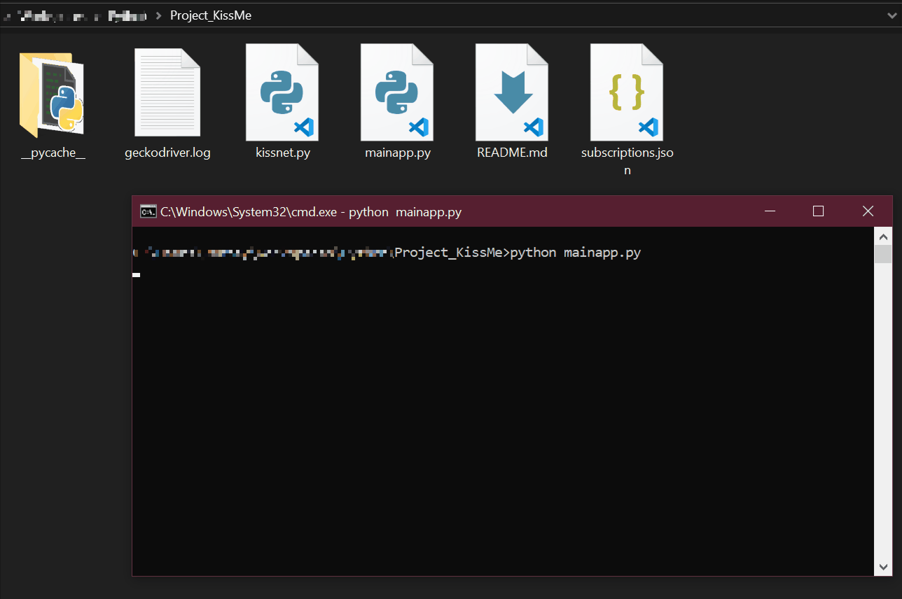

# KissMe

> Auto download files from the Kiss- network! (Currently works for KissAsian and KissAnime)

## Background

I really like watching my favorite series offline while commuting, but accessing and downloading them from KissAsian/KissAnime can be a pain sometimes due to the incessant amounts of ads. I then tested the possibility of scraping the website while learning web scraping in the process and thus this 1 week project was born.



## Setup

Python Version: 3.6.7

Dependencies:

```sh
pip install beautifulsoup4
pip install selenium
pip install tqdm
pip install cfscrape
```

Lastly, you will need a copy of the Firefox Webdriver. 

## Usage example

#### Subscriptions
Subscriptions are in the form of a json object. The user can add subscription to a source:

eg: https:/<span></span>/kissasian.sh/Drama/The-Link-Of-The-Drama

```json
{
  "Sources": {
    "KissAsian": [
        {
            "Title": "The Drama",
            "Link": "The-Link-Of-The-Drama",
            "Bookmark": 1,
            "EpisodeLinks": "THIS-IS-AUTO-FILLED",
            "Status": "THIS-IS-AUTO-FILLED"
        }
    ]
  }
}
```
-For now, only 2 sources are KissAsian and KissAnime
-Title: The title of the drama (The created folder will also use this name)
-Link: The name of the drama from the html link
-Bookmark: Where the program will start searching for new episodes
-EpisodeLinks: List of the episode links. This is automatically filled by the program.
-Status: Ongoing or Completed. This is also automatically filled by the program.

#### Main Program
in mainapp.py<span></span>
```python
GECKO_DRIVER_PATH = "C:\geckodriver\geckodriver.exe"
KISSANIME_USERNAME = ""
KISSANIME_PASSWORD = ""
KISSASIAN_USERNAME = ""
KISSASIAN_PASSWORD = ""
```
-Add the path where you extracted the geckodriver to the GECKO_DRIVER_PATH
-While the program works without having a Kiss- account. The download links will expire much faster because the link is grabbed from the video stream source.
-Next, just run the python app in terminal and let it run until it has completed downloading the episodes!

##Limitations
-Script function is directly tied to the structure of the html. If the structure changes, the script may not work anymore.
-Can only download 1 file at a time
-The server uses CloudFlare which is very javascript heavy. Using requests alone won't work in accessing the website. Thus, Selenium is used to simulate the browser. Which can be slow (Delays must be present for the javascript to fully load) 

## Planned Features
- Enable to work with movies
- Enable to work with KissManga
- Multiple downloads
- Notifications
- Deleting Episodes and subscriptions in the json file
- Selective json files and subscriptions (Benefitial if subscriptions have many episodes)

## Release History

* 0.5.0
    * Beta release